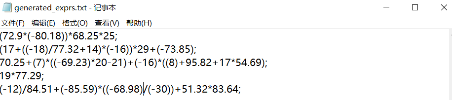

## **实验内容：**

1） 实现一个完整的 Java
程序，它读取文件中的中缀表达式（每个表达式以分号结束，文件中可以有多个表达式）并转换为等价的后缀表达式后输出到屏幕上。表达式中的运算量可以是任意整数或者小数，支持加、减、乘、除、取负运算以及小括号，表达式中的空格、制表符等空白符号可以被忽略。若用户输入的表达式有误，则提示用户错误的位置。譬如两个运算量之间缺少运算符、或运算符缺少左（或右）运算量等。错误处理功能的最低要求是当输入表
达式有错时，给出一个报错信息，提示错误的位置和类别。学有余力的学生还可
考虑尝试如何实现出错恢复（Error
Recovery），即当程序发现一个错误时不是立马停下来，而是能够从跌倒的地方爬起来，继续分析下去，从而一次运行即可发现更多的错误。

2） 为以上的 Java 程序提供一个随机测试数据发生器（用 Java 语言来写），生成
若干随机的正确表达式和不正确表达式（通过命令行参数决定是生成正确的还是
不正确的以及生成的数量）。生成的测试数据要求写入文件，可以被 1）中的程序读取。

**实验要求：**

实验结果不应只包含源程序代码，还应包括一个实验报告文档（建议命名为 design.doc 或
design.pdf）、编译与运行程序的脚本。此外，至少还要包括一个纯文本的自述文件
readme.txt，其中描述你自己的姓名、学号等基本信息。实验结果全部存放在一个名为“学号姓名”（中间不要任何空格）的文件夹中。

1.  **设计思路：**

本程序的设计思路如下：先书写出中缀表达式四则运算的文法规则，接着采用自顶向下分析法进行分析，在分析的过程中加入语义动作，将中缀表达式转化为后缀表达式输出到控制台。

中缀表达式四则运算文法规则如下：

\*expr-\>term rest

\*rest-\>+ term\|- term\|ε

\*term-\>factor op

\* op-\> \* factor\| / factor\| ε

\*facror-\> (expr) \| num \| ( -factor)

程序的编写采用的是递归子程序分析法。递归子程序法是一种确定的自顶向下语法分析方法，要求文法是LL(1)文法。它的实现思想是对应文法中每个非终结符编写一个递归过程，每个过程的功能是识别由该非终结符推出的串，当某非终结符的产生式有多个候选式时能够按LL(1)形式唯一地确定选择某个候选式进行推导。

1.  **功能介绍**

运行程序后，进入控制台界面。如下图所示，用户根据提示键入“1”或“2”选择相应的功能。

1.  **生成表达式**

当用户输入“1”后将进入下个界面。在这里可选择生成正确的表达式或者错误的表达式。

键入相应的数字“1”或“2”后 需要输入要生成的数量，之后会有成功生成的信息。

1.  **中缀表达式转换为后缀表达式**

当用户输入“2”后，会进入以下界面。

键入文件路径后，程序将会把结果输出到控制台。

1.  **核心代码**

    1.  生成表达式，生成表达式是通过实例化类product，调用其creat()或creat_1()方法生成。

1.  中缀表达式转后缀表达式主控函数

1.  匹配函数

1.  **测试**

2.  生成正确的表达式。

1.  到对应目录查看结果。

1.  将生成的表达式转化为后缀表达式。

1.  生成错误的表达式

1.  到对应目录下查看。

1.  将中缀表达式转化为后缀表达式。

**五、实验总结**

本实验的主体要求是将中缀表达式转化为后缀表达式。本小组实现的方式是：将中缀表达式的文法规则书写出来，再转化为ll(1)文法。接着采用自顶向下分析法进行语义分析，在分析的过程中加入语义动作，转化成后缀表达式。使用递归子程序法编写程序。

将中缀表达式转化为后缀表达式在大二的《数据结构》课程就已经实现过了。但在这里是用《编译原理》课程里的方法实现。两种实现方式一比较，使我更加理解语法分析的过程及应用。同时，本次实验是同小组内其他两名成员一起实现，锻炼了我的小组协作能力。
